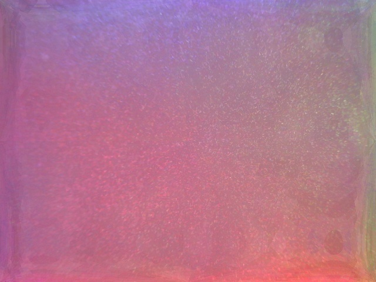
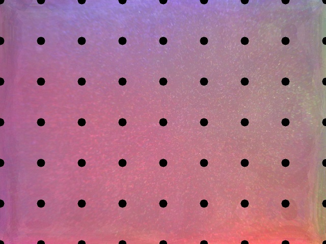
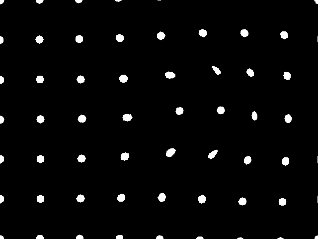
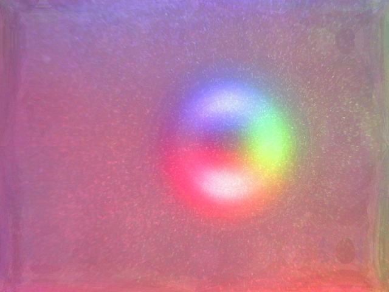
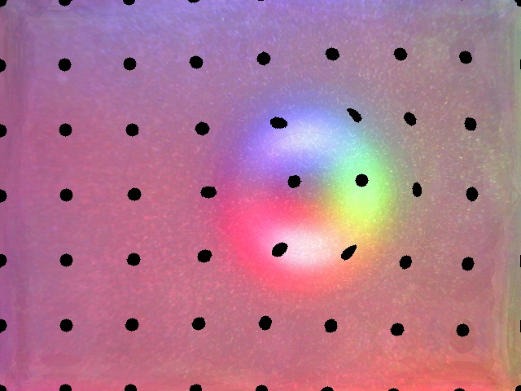
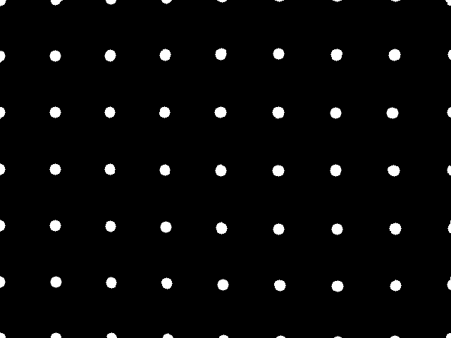
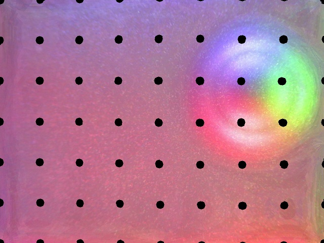

# Taxim: An Example-based Simulation Model for GelSight Tactile Sensors
Taxim is an example-based simulator for GelSight tactile sensors and its variations. For more information of Taxim, you can check the [paper](https://arxiv.org/abs/2109.04027) or the [webpage](https://labs.ri.cmu.edu/robotouch/taxim-simulation/).

## Installation and Prerequisites
Basic dependencies: numpy, scipy, matplotlib, cv2

To install dependencies: `pip install -r requirements.txt`

Optional dependencies: ros with usb-cam driver (to collect the tactile images from a tactile sensor), nanogui (to annotate the raw data.)

To install ros usb-cam driver, please check out [here](https://github.com/ros-drivers/usb_cam).

To install nanogui, please check out [here](https://github.com/wjakob/nanogui).

## Usage
If you want to customize the Taxim on your own sensor, please follow the DataCollection and Calibration to calibrate the Taxim and generate calibration files. And modify the parameters under `Basic.params` and `Basic.sensorParams` accordingly.

We provide a set of calibration files and you can work with them directly. You can follow instruction of Optical Simulation and Marker Motion Field Simulation to start working with the provided examples. And feel free to change the parameters under `Basic.params`.

## Data Collection (optional)
1. Connect a GelSight sensor with your pc and launch the camera driver.
2. Change the `self.gel_sub` in `gelsight.py` to your sensor camera's topic.
3. Run `python record_Gel.py` and input the file name and number of frames to collect the data.

## Calibration (optional)
1. Generate data pack: Run `python generateDataPack.py -data_path DATA_PATH` where `DATA_PATH` is the path to the collected raw tactile data. Hand annotate the contact center and radius for each tactile image. `dataPack.npz` will be saved under the `DATA_PATH`.
2. Generate polynomial table: Run `python polyTableCalib.py -data_path DATA_PATH` where `DATA_PATH` is the path to the data pack. `polycalib.npz` will be saved under the `DATA_PATH`.
3. Generate shadow table: Run `python generateShadowMasks.py -data_path DATA_PATH` where `DATA_PATH` is the path to the collected shadow calibration images. `shadowTable.npz` will be saved under the `DATA_PATH`.
4. Generate FEM tensor maps: Export the ANSYS FEM displacement txt files and set the path in the main function. Run `python generateTensorMap.py` and `femCalib.npz` will be saved under `calibs` folder.

All the calibration files from a GelSight sensor have been provided under `calibs` folder.

## Optical Simulation
You can input a point cloud of a certain object model and define the pressing depth, or directly input a depth map. All the parameters in `Basic.params` are adjustable. `depth` is in millimeter unit.

Run `python simOptical.py -obj square -depth 1.0` to visualize the examples. Results are saved under `results`.


## Marker Motion Field Simulation
You can input a point cloud of a certain object model and define the loads on x, y, z directions. `dx` and `dy` are shear loads and `dz` is normal loads, which are all in millimeter unit.
Run `python simMarkMotionField.py -obj square -dx 0.3 -dy 0.4 -dz 0.5` to visualize the resultant displacements. Results are saved under `results`.

## Operating System
Taxim has been tested on macOS Catalina (10.15.7) and Ubuntu (18.04.1) with anaconda3.

Configuration for MacOS:
python 3.8.5,
numpy  1.20.1,
scipy  1.6.1,
opencv-python 4.5.3.56

Configuration for Ubuntu:
python 3.6.13,
numpy 1.19.5,
scipy 1.5.4,
opencv-python 4.5.2.54


## License
Taxim is licensed under [MIT license](LICENSE).

## Citating Taxim
If you use Taxim in your research, please cite:
```BibTeX
@article{si2021taxim,
  title={Taxim: An Example-based Simulation Model for GelSight Tactile Sensors},
  author={Si, Zilin and Yuan, Wenzhen},
  journal={arXiv preprint arXiv:2109.04027},
  year={2021}
}
```
# Marker Simulation
```bash
python OpticalSimulation/msimCirclewithmarker.py
```
|Makrer|Markerless|Markered|
|---|---|---|
||||
||||
||||

